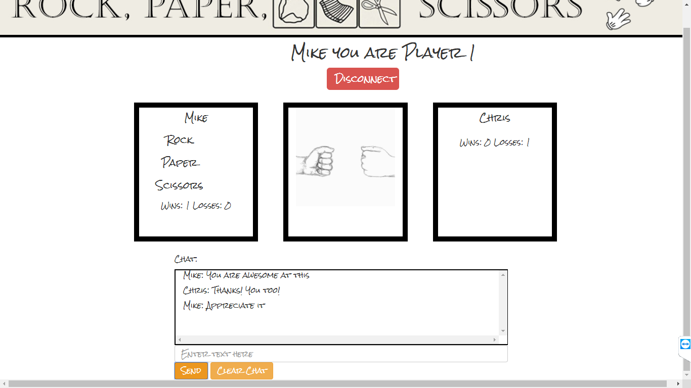

# Rock, Paper, Scissors Multiplayer Game

This is a Firebase based game that allows two people to play against each other online in the classic Rock, Paper, Scissors game.

## Getting Started
To begin a user must enter their name in and wait on a second player. Once a second player has entered their name the game will being.  

Once both players have selected their choice, the winner is revealed as well as what both players selected.  After 5 seconds the game starts over.

This fun can last for hours, but what is a online multiplayer game without a little smack talking. I also incorporated a basic chat feature which allows users to interact with each other instantly.

## Technologies Used
* Html
* Bootstrap
* Css
* Javascript
* JQuery
* Firebase
* Photoshop
